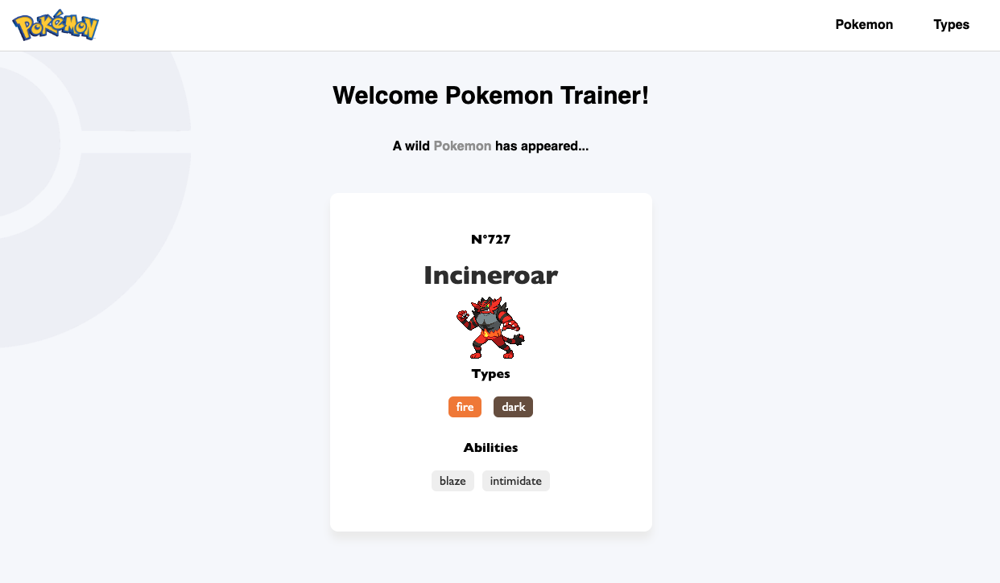

# Pokemon React - Frontend 🐥

As part of my training at [Le Reacteur](https://www.lereacteur.io/) to become a full-stack developer, we were tasked with building a Pokemon website using [Pokeapi](https://pokeapi.co/)'s API.

_This website is just an exercise and will not be deployed or used, besides as a portfolio piece. All the images used are not my property._

## Overview 🚀

Check out the live demo [here](https://pokemonreact-2024.netlify.app/) and test it! 😊

It is fully responsive for all devices, built using ReactJS, Javascript, HTML, CSS and Axios.



## Tasks 🧐

✓ Creation of the layout, responsive frontend

✓ Use of Pokeapi's API to get the list of pokemon, info on a pokemon, the list of types and the list of pokemon for each type

✓ Displaying a random pokemon and its info on the Home page

✓ Displaying all Pokemon and information on each Pokemon

✓ Displaying all types and the list of pokemon for each type

✓ Implementing pagination

✓ Use of states

✓ Loading screen

✓ Make the design responsive using media queries

## Stacks 📚

- ReactJS
- JavaScript
- HTML5
- CSS3
- Axios
- Media queries (responsive design)

## Prerequisites 🤔

Before you begin, ensure you have met the following requirements:

✓ [Git](https://git-scm.com/downloads) must be installed on your operating system.

## Installing Pokemon React's website 🗝️

To install the website, follow these steps:

1. Clone this repository or download the ZIP file

```bash
git clone https://github.com/Potaaeeto/PokemonReact.git
```

```bash
cd PokemonReact
```

2. Install packages

```bash
yarn
```

3. When installation is complete

```bash
yarn dev
```
